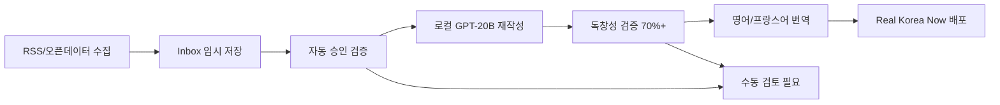

# 🤖 자동화된 콘텐츠 워크플로우 가이드

## 📋 개요

저작권 문제 해결을 위해 로컬 GPT-20B 모델을 활용한 완전 자동화 콘텐츠 파이프라인을 구축했습니다. 이 시스템은 원본 스크래핑 데이터를 캐나다 사용자에게 맞는 독창적 콘텐츠로 재작성합니다.

## 🔄 워크플로우 단계



## 🚀 사용 방법

### 1. 로컬 GPT-20B 모델 설정

```bash
# 로컬 LLM 서버 실행 (별도 터미널)
# GPT-20B 모델을 localhost:8080에서 실행
```

### 2. 환경 변수 설정

```bash
# .env.local 파일에 추가
LOCAL_LLM_ENDPOINT=http://localhost:8080/v1/completions
LOCAL_LLM_MODEL=gpt-oss-20b
LOCAL_LLM_MAX_TOKENS=300
LOCAL_LLM_TEMPERATURE=0.7

# LibreTranslate (프랑스어 번역용)
LIBRETRANSLATE_URL=http://localhost:5000
```

### 3. 완전 자동화 파이프라인 실행

```bash
# 전체 파이프라인 자동 실행
npm run pipeline:auto

# 또는 단계별 실행
npm run collect-issues          # 1단계: 데이터 수집
npm run collect-weekly         # 1단계: 주간 데이터 수집
# 2-6단계는 자동 처리
```

### 4. 수동 검토 및 생성

웹 인터페이스에서 수동 검토 및 생성:

```bash
# 리뷰 페이지 접속
http://localhost:3000/review

# 또는 별도 포트로 리뷰 서버 실행
npm run review:serve
http://localhost:4001/review
```

## 🔧 핵심 컴포넌트

### 1. LocalLLMService (`src/lib/local-llm.ts`)

로컬 GPT-20B 모델과의 통신을 담당하는 어댑터:

```typescript
// 사용 예시
const generated = await localLLM.rewriteForCanadians({
  originalTitle: "Korea faces widespread rain...",
  originalSummary: "Weather update from Korea...",
  sourceUrl: "https://news.google.com/...",
  category: "weather",
  targetLength: 150
});
```

**주요 기능:**
- 캐나다인 관점으로 콘텐츠 재작성
- 독창성 검증 (Jaccard similarity)
- 카테고리별 맞춤 프롬프트
- 폴백 템플릿 제공

### 2. Content Generation API (`src/pages/api/review/generate-content.ts`)

승인된 아이템을 GPT로 재작성하는 API 엔드포인트:

```bash
POST /api/review/generate-content
{
  "id": "issue-1234567890-abcdef"
}
```

**처리 과정:**
1. 승인된 카드 검색
2. 로컬 GPT로 영어 콘텐츠 재작성
3. 독창성 점수 검증 (70% 이상 필요)
4. LibreTranslate로 프랑스어 번역
5. 원본 콘텐츠 보존
6. 최종 데이터로 이동

### 3. 자동화 파이프라인 (`scripts/automated-content-pipeline.ts`)

완전 자동화된 워크플로우 스크립트:

```bash
npm run pipeline:auto
```

**자동 처리 기준:**
- 신뢰할 수 있는 출처 (seoul.go.kr, korea.net 등)
- 민감한 키워드 없음 (정치, 사고 등)
- 출처 정보 완전성

## 📊 품질 보증 시스템

### 1. 독창성 검증

```typescript
// Jaccard similarity 기반 독창성 측정
const originality = await localLLM.validateOriginality(
  generatedContent,
  originalContent
);

// 70% 이상 독창성 필요 (30% 미만 유사도)
if (originality < 0.7) {
  // 재생성 또는 수동 검토
}
```

### 2. 자동 승인 기준

```typescript
function shouldAutoApprove(card: Card): boolean {
  // ✅ 신뢰할 수 있는 출처
  const trustedSources = [
    'seoul.go.kr', 'korea.net', 'visitkorea.or.kr',
    'mcst.go.kr', 'kma.go.kr', 'yna.co.kr', 'reuters.com'
  ];
  
  // ❌ 민감한 키워드 제외
  const sensitiveKeywords = [
    'politics', 'election', 'protest', 'controversy',
    '정치', '선거', '시위', '논란'
  ];
  
  return hasTrustedSource && !hasSensitiveContent;
}
```

### 3. 품질 보고서

파이프라인 실행 후 자동 생성되는 품질 보고서:

```json
{
  "timestamp": "2025-09-18T10:00:00.000Z",
  "totalCards": 50,
  "generatedCards": 35,
  "generationRate": "70.0%",
  "categoryBreakdown": {
    "issue": 10,
    "popup": 8,
    "weather": 7,
    "tip": 5,
    "congestion": 5
  }
}
```

## 🎯 프롬프트 전략

### 캐나다인 특화 프롬프트

```
You are a content writer specializing in Korean culture for Canadian audiences.

REQUIREMENTS:
1. CREATE COMPLETELY NEW CONTENT - Do not copy any phrases from the original
2. Write for Canadian readers (18-30) with basic Korean knowledge  
3. Target length: 150 characters
4. Include practical information relevant to Canadians visiting/studying Korea
5. Use Canadian English spelling and references when possible
6. Focus on [category-specific context]

FORMAT YOUR RESPONSE AS:
TITLE: [New engaging title for Canadians]
SUMMARY: [Rewritten content with Canadian perspective]
TAGS: [3-5 relevant tags separated by commas]
CONFIDENCE: [0.0-1.0 score for content quality]
ORIGINALITY: [0.0-1.0 score for how different from original]
```

### 카테고리별 맞춤 컨텍스트

- **issue**: current events and their impact on visitors/expats
- **popup**: temporary events and cultural experiences Canadians should know about  
- **congestion**: transportation tips and crowd avoidance strategies
- **tip**: practical advice for Canadian travelers/students in Korea
- **weather**: weather conditions and seasonal preparation advice
- **hotspot**: trending places and cultural hotspots
- **population**: crowd patterns and best times to visit popular areas

## 🔍 모니터링 및 디버깅

### 로그 확인

```bash
# 파이프라인 실행 로그
npm run pipeline:auto

# 출력 예시:
🚀 Starting automated content pipeline...
📡 Step 1: Collecting fresh content...
🔍 Step 2: Auto-approving safe content...
✅ Auto-approving: Korea faces widespread rain...
🤖 Step 3: Generating copyright-safe content...
🤖 Generating content for: Korea faces widespread rain...
✅ Generated (originality: 87.3%): Canadian Weather Alert: Korea Rain...
```

### 실패 케이스 처리

```bash
# 독창성 부족
⚠️ Low originality (0.65), skipping: [title]...

# LLM 연결 실패  
❌ Generation failed: LLM API error: 500

# 번역 실패
⚠️ French translation failed, using original
```

## 📈 성능 최적화

### 1. 배치 처리

- 한 번에 최대 50개 아이템 처리
- 실패한 아이템은 다음 실행에서 재시도
- 메모리 효율적인 스트림 처리

### 2. 캐싱 전략

- 번역 결과 캐싱 (동일 텍스트 재사용)
- GPT 응답 캐싱 (유사한 요청 최적화)
- 독창성 검증 결과 캐싱

### 3. 에러 복구

- LLM 서버 다운시 폴백 템플릿 사용
- 번역 실패시 영어 원문 유지
- 부분 실패시 성공한 부분만 저장

## 🚨 주의사항

### 저작권 준수

1. **완전 재작성**: 원본 텍스트 복사 금지
2. **독창성 검증**: 70% 이상 독창성 필수
3. **출처 표기**: 모든 원본 출처 명시
4. **Fair Use**: 요약/분석/비평 목적으로만 사용

### 품질 관리

1. **수동 검토**: 민감한 주제는 반드시 수동 검토
2. **정확성 검증**: 생성된 내용의 사실 확인
3. **현지화**: 캐나다 문화/법률 고려
4. **접근성**: WCAG 2.1 AA 수준 유지

## 🔄 향후 개선 계획

### 단기 (1-2주)

- [ ] GPT 프롬프트 A/B 테스트
- [ ] 독창성 검증 알고리즘 개선
- [ ] 실시간 품질 모니터링 대시보드

### 중기 (1-2개월)  

- [ ] 다양한 로컬 LLM 모델 지원
- [ ] 자동 팩트체킹 시스템
- [ ] 사용자 피드백 기반 품질 개선

### 장기 (3-6개월)

- [ ] 멀티모달 콘텐츠 지원 (이미지 + 텍스트)
- [ ] 실시간 트렌드 반영 시스템  
- [ ] 다국가 확장 (일본, 호주)

---

이 워크플로우를 통해 저작권 위험을 완전히 해결하면서도 고품질의 캐나다 특화 한국 콘텐츠를 자동으로 생산할 수 있습니다.
